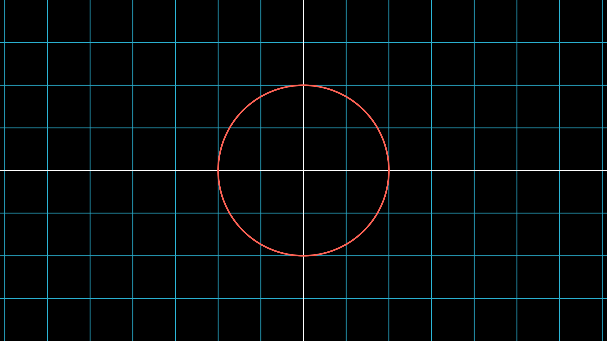
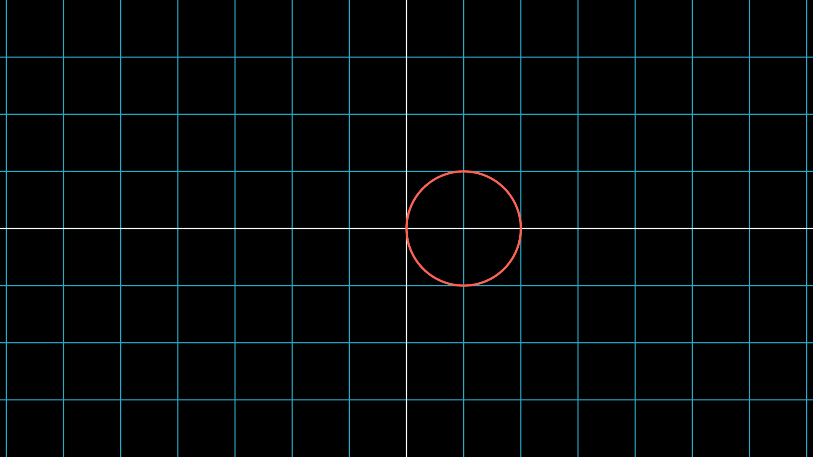
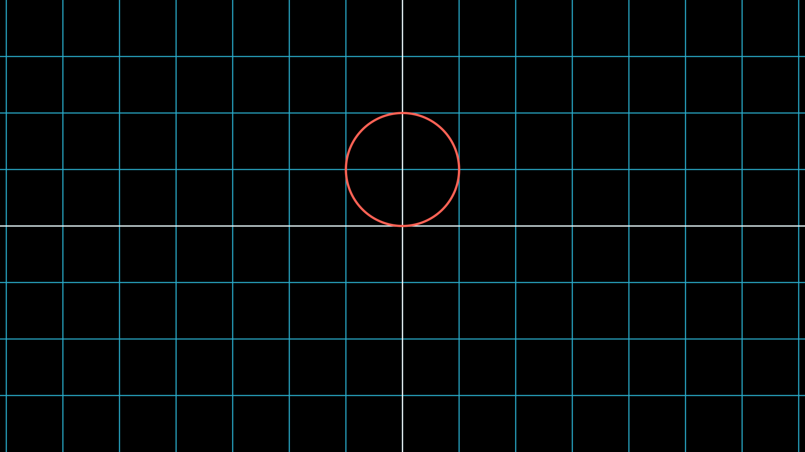
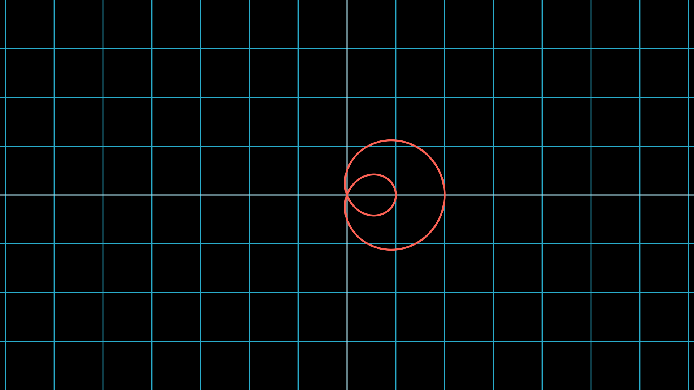
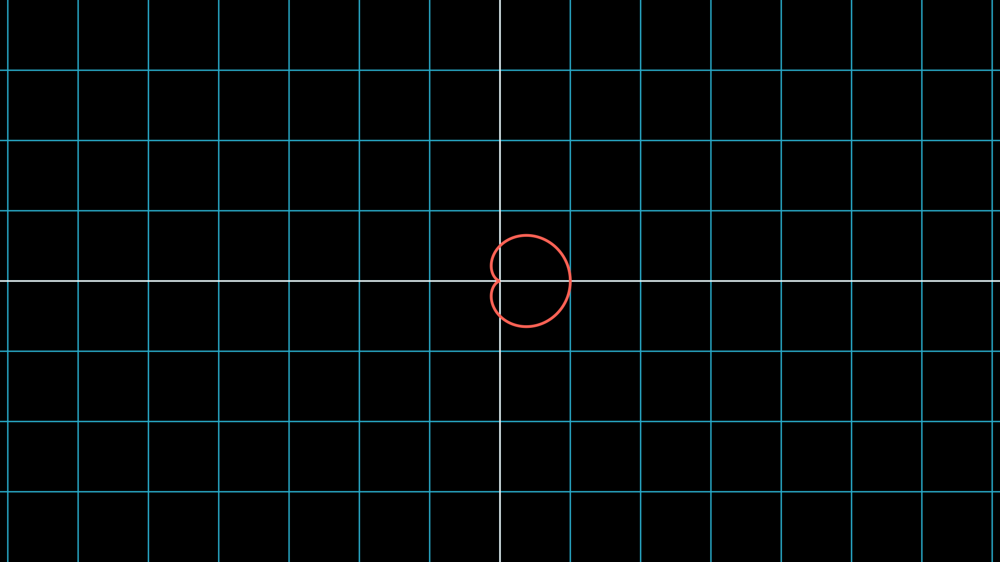
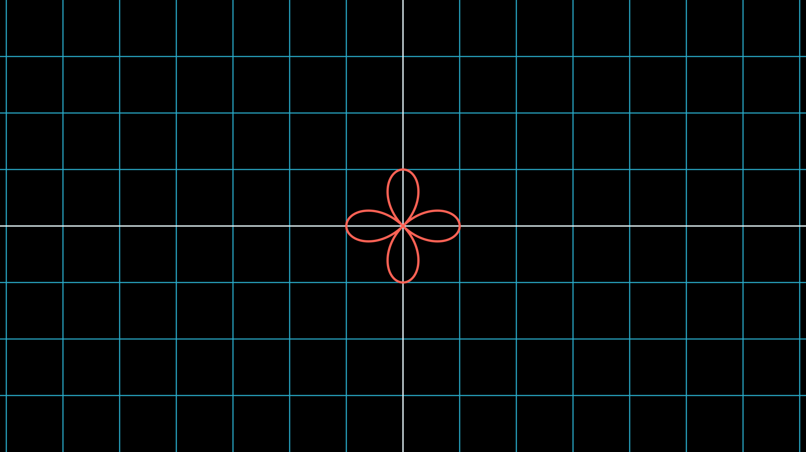

# Polar Curves

This repository contains animations aiming to explain various attributes of polar curves, such as their nature, what equations look like what curves, differentiating polar curves, and finding area underneath polar curves.

## Animations

### First

TODO - Explaining what polar functions are and how they are different from traditional, cartesian functions

### Circles

#### Circles centered at the origin

$r(\theta) = a$

[pc_simple_circle.py](./pc_simple_circle.py)

#### Circle generated with $\cos(\theta)$

$r(\theta) = a \cdot \cos(\theta)$

[pc_cos_circle.py](./pc_cos_circle.py)

#### Circle generated with $\sin(\theta)$

$r(\theta) = a \cdot \sin(\theta)$

[pc_sin_circle.py](./pc_sin_circle.py)

### Limacons

$a + b \cdot \sin(\theta)$ and $a + b \cdot \cos(\theta)$

#### Looped Limacon

$|\frac{a}{b}| < 1$

[looped.py](./looped.py)

#### Cardioid Limacon

$|\frac{a}{b}| = 1$

[cardioid.py](./cardioid.py)

#### Dimpled Limacon

$|\frac{a}{b}| > 1$

[dimpled.py](./dimpled.py)

### Rose Curves

$r(\theta) = a \cdot \sin(b \cdot \theta)$ and $r(\theta) = a \cdot \cos(b \cdot \theta)$

[rose_curves.py](./rose_curves.py)